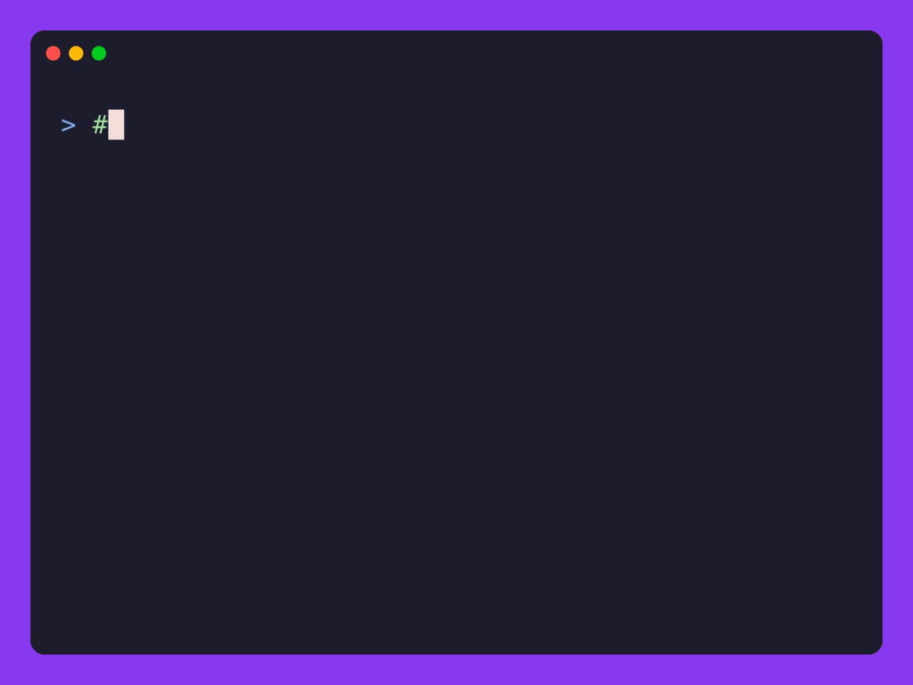

<p align="center">
  
</p>

# <p align="center">JACK</p>

<p align="center">
  <strong>A versatile CLI tool for common developer tasks.</strong>
</p>

<p align="center">
  
  
  
  
  
</p>


## Installation

### Quick Install (Recommended)

**Linux / macOS:**
```bash
curl -fsSL https://raw.githubusercontent.com/dimeskigj/jack-cli/main/scripts/install.sh | bash
```

**Windows (PowerShell):**
```powershell
iwr https://raw.githubusercontent.com/dimeskigj/jack-cli/main/scripts/install.ps1 -useb | iex
```

### From Source
1. Clone the repository:
   ```bash
   git clone https://github.com/dimeskigj/jack-cli.git
   cd jack-cli
   ```
2. Build and install:
   ```bash
   ./gradlew installDist
   ```
3. Add the binary to your `PATH`. The binary is located at `build/install/jack/bin`.

### Native Image
To build a standalone executable that doesn't require Java installed:
```bash
./gradlew nativeCompile
```
The executable will be located in `build/native/nativeCompile`.

### From Releases
Download the latest archive from the [releases page](https://github.com/dimeskigj/jack-cli/releases), extract it, and add the `bin` folder to your `PATH`.


## Usage

### UUIDs
#### UUID Generation
Generate one or more UUIDs or ULIDs using the `generate` subcommand. 
```bash
jack uuid generate
jack uuid generate --count 5 --type ULID
```

#### Validate UUID/ULID
Validate a single UUID or ULID value using the `validate` subcommand.
```bash
jack uuid validate <uuid>
echo "3fa85f64-5717-4562-b3fc-2c963f66afa6" | jack uuid validate
jack uuid validate --type ULID <ulid>
```

### Lorem Ipsum
Generate placeholder text.
```bash
jack lorem --count 50
```

### QR Codes
Generate a QR code image from text or a URL.
```bash
jack qr "https://github.com" --output github.png
jack qr "Hello World" --foregroundColor FF0000 --backgroundColor FFFFFF
```

### Hashing
Compute hashes for strings or files.
```bash
jack hash "my secret string" --algorithm SHA256
jack hash --file path/to/file.txt --algorithm MD5
```

### Timestamps
Get the current Unix timestamp.
```bash
jack timestamp
jack timestamp --unit MILLISECONDS
```

### JWT Decoding
Decode and pretty print a JWT token.
```bash
jack jwt "your.jwt.token"
jack jwt "your.jwt.token" --secret "your-secret"
```

### JSON Formatting
Process, query, and format JSON input.
```bash
jack json '{"name":"jack","version":1}'
jack json --file data.json --indent 2
cat data.json | jack json
```

#### Query JSON
Extract values using dot-notation and array indices.
```bash
jack json -q ".name" '{"name":"jack"}'
jack json -q ".user.id" '{"user":{"id":123}}'
jack json -q ".items[0]" '{"items":["a","b","c"]}'
jack json -q ".users[1].name" '{"users":[{"name":"alice"},{"name":"bob"}]}'
```

#### Compact Output
Output minified JSON on a single line.
```bash
jack json --compact '{"name": "jack", "version": 1}'
jack json -c -q ".data" '{"data":{"a":1,"b":2}}'
```

### Shell Completion
Enable tab completion for jack commands in your shell.
```bash
jack completion
```

**Bash:**
```bash
echo 'eval "$(_JACK_COMPLETE=bash jack)"' >> ~/.bashrc
source ~/.bashrc
```

**Zsh:**
```bash
echo 'eval "$(_JACK_COMPLETE=zsh jack)"' >> ~/.zshrc
source ~/.zshrc
```

**Fish:**
```bash
_JACK_COMPLETE=fish jack > ~/.config/fish/completions/jack.fish
```

## Features
- **UUID/ULID**: Validation and bulk generation of unique identifiers.
- **Lorem Ipsum**: Customizable placeholder text.
- **QR Codes**: PNG generation with custom colors.
- **Hashing**: MD5, SHA1, SHA256, SHA512 support.
- **Timestamps**: Seconds or milliseconds.
- **JWT Decoding**: Pretty print header and payload with signature verification.
- **JSON Processing**: Query, format, and minify JSON with dot-notation queries.

## License
MIT


## Contributors

A big thank you to everyone who contributes!

<a href="https://github.com/dimeskigj/jack-cli/graphs/contributors">
  
</a>
